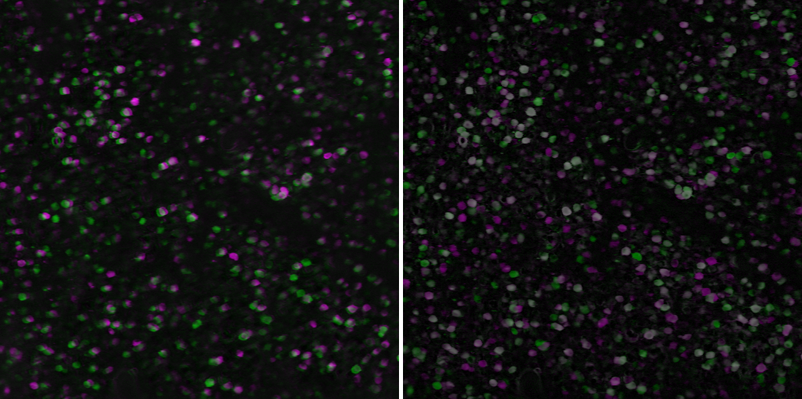
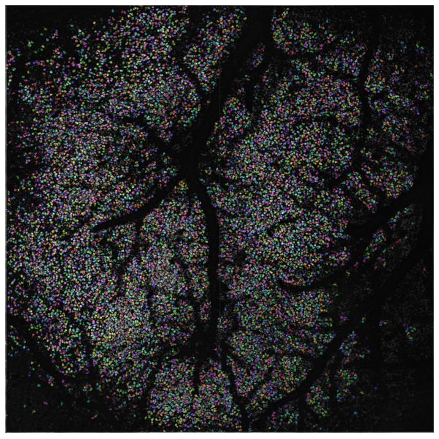
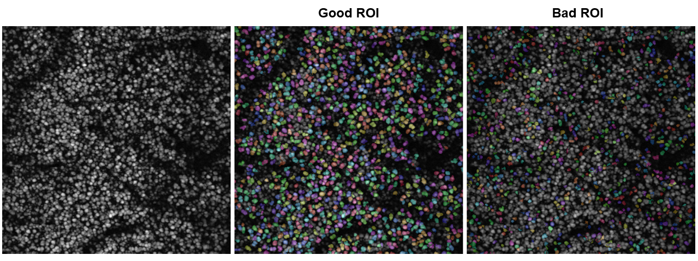

# Low computational-cost cell detection (LCCD) for a large field of view two-photon calcium imaging data

### Paper
#### Low computational-cost cell detection method for calcium imaging data (Ito et al., Neuroscience Research, 2022)

https://doi.org/10.1016/j.neures.2022.02.008

### Requirement
- Matlab

### Install
- download .zip

### Usage
#### Parameter setting
- LCCD_setting.m
   - set path
   - set running processes
   - set parameters

### Run LCCD
- run LCCD_pipeline.m

### Quality check
1. Motion correction
   - open .h5 file in 01_NoRMCorre in Fiji
   - check removal of motion artifacts
2. Misalignment of template
   - open image_std_xx.tif files in 02_simp_roi_detect in Fiji
   - stack images and check alignmend, then perform max intensitiy z-projection
   
      
      
3. ROI morphology
   - open ROI_Cell_color.tiff in 10_calculate_metrics
   - overlay z-projection image to the ROI_Cell_color and check the ROI poistion and morpholoy
      
      

### For further analysis
- dF_F0 -> load dF_F.mat from 04_extract_signals
- ROI metics -> load ROI_metrics.mat from 05_calculate_metrics

